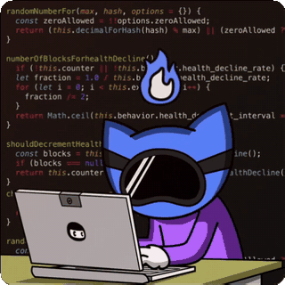
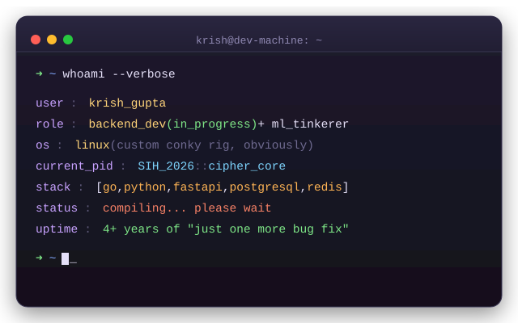

<h1 align="center">Krish Gupta</h1>
<h3 align="center">
  Computer Science & Applied Mathematics Student
</h3>

  Exploring AI • Backend Systems • Problem Solving

  

  

---

<h2>💫 About Me</h2>
<ul>
  <li>
    🎓 B.Tech student in 
    <strong>Computer Science and Applied Mathematics</strong>
  </li>
  <li>
    🧠 Interested in 
    <strong>Artificial Intelligence</strong>, 
    <strong>Backend Development</strong>, and 
    <strong>Problem Solving</strong>
  </li>
  <li>
    🚀 Currently building an 
    <strong>AI-assisted News Credibility System</strong>
  </li>
  <li>
    📚 Exploring Python, FastAPI, Go, Machine Learning, and Data Analysis
  </li>
  <li>
    📫 Reach me at: 
    <strong>thepresence060@gmail.com</strong>
  </li>
</ul>

---

<h2>💻 Tech Stack</h2>

  

  
  
  
  
  
  
  

  
  
  
  
  
  
  

---

<h2>🖥️ whoami</h2>

  

---

<h2>🚀 Featured Projects</h2>
<h3>
  <a href="https://github.com/ThePresence060/GenNews">
    GenNews
  </a>
</h3>

  Machine learning powered system that evaluates the credibility of online news articles using NLP and classification techniques.

  
  
  
  

 
<h3>
  <a href="https://github.com/ThePresence060/upgraded-barnacle">
    CollabOS
  </a>
</h3>

  Team collaboration platform designed to simplify project management, task distribution, and real-time progress tracking for collaborative teams.

  Features include AI-powered task generation, weighted task allocation based on complexity, and real-time tracking of workflow progress and contributions.

  Built with a focus on clean UI/UX, scalability, and developer-friendly collaboration workflows.

  
  
  
  
  

<h2>🎯 Current Focus</h2>
<pre>
<code>
Learning = [
    "Backend Development (Go & FastAPI)",
    "Concurrency & REST APIs",
    "Machine Learning",
    "Data Analysis",
    "System Design",
    "Open Source Contributions"
]
</code>
</pre>

---

<h2>🎮 Side Quests</h2>

  When I'm not shipping code, you'll find me on one of these:

  
  
  

---

<h2>🌐 Connect With Me</h2>

  

---

  <i>
    "Strong fundamentals and meaningful projects matter more than hype."
  </i>

